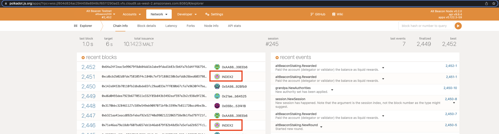
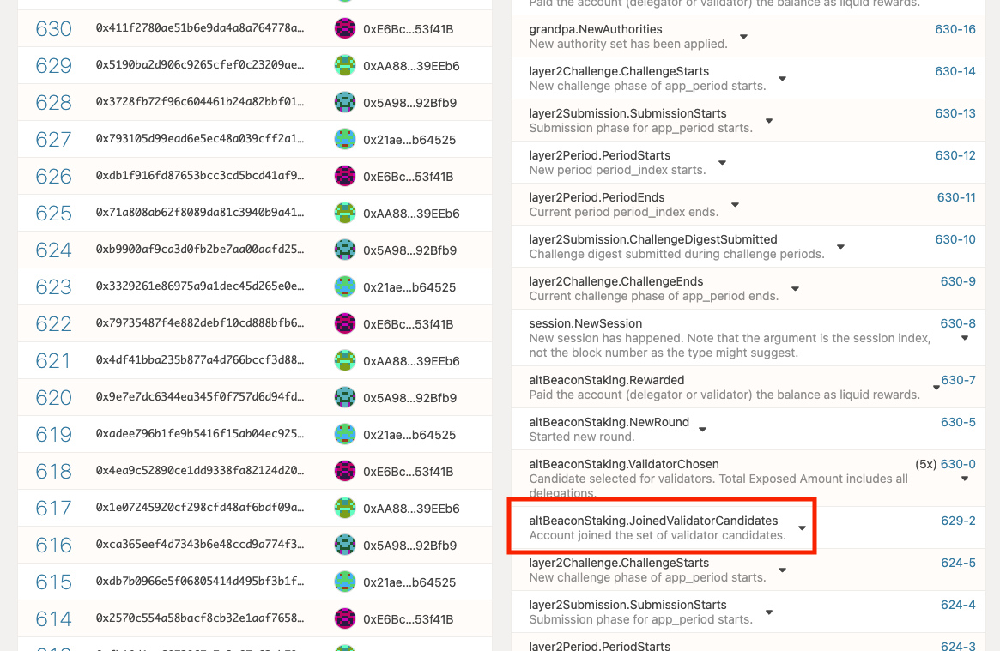

# AltLayer Beacon Validator

This directory consist the scripts to help you deploy a _AltLayer Beacon Validator_ your self.

## 0. Pre-requesties

Before you start, make sure you have

1. Docker environment
2. Bash script runtime
3. A beacon layer account, with at least 1,001 ALT, (1000 for stake, 1 for gas fee)
4. [Altctl](https://github.com/alt-research/altctl) installed
  ```bash
    # you can download it with gh cli, but the cli require some setup
    gh -R alt-research/altctl release download --clobber -p "altctl*amd64.deb"
    sudo dpkg -i altctl*amd64.deb
    rm altctl*amd64.deb
    altctl --version
  ```

## 1. Generate Keystore for Consensus

Run: `bash ./generate-keys.sh`

Two files `MNEMONIC` and `vars.env` will be generated under current directory.

## 2. Bootup your node.

```bash
docker-compose up -d
```

You can use your docker desktop UI to check the log or use `docker logs -f devnet-beacon-validator`

If all went well, you'll see your node discovering external nodes and start syncing blocks.

## 3. Fund your account
Remember to fund it with at least 1,001 ALT.

## 4a. Stake via script
You can stake your tokens by following the following steps or if you prefer to do it manually, you can skip and [continue to our "Stake manually" section](#4b-stake-manually).

Run `stake.sh`
This script will try and attempt to install `altctl` and will perform the following:
- generate a session key
- submit extrinsics session::setKeys using the session key
- altBeaconStaking::joinCanditates by staking the amount specified in the script

## 4b. Stake manually
You can stake your tokens manually by following the steps below or if you prefer to stake your tokens via script, you can refer to our [previous section](#4a-stake-via-script).

### 1. Prepare your account

You need to prepare a account to stake, make sure it has balance at least 1,001 ALT.

### 2. Call RPC author_rotateKeys to generate the new (consensus) keys for this node and return the sessionkey value

```bash
altctl author rotate-keys --endpoint ws://localhost:9944 > session_key.txt
```

### 3. Submit the extrinsic Session::setKeys from this account.

```bash
altclt session set-keys --endpoint ws://localhost:9944 \
  --keys=$(cat session_key.txt) \
  --proof=0x \
  --seed="<private key or mnemonic of your staking account>"
```

### iv. Join as a staking candidate

```bash
altctl join-candidate --endpoint ws://localhost:9944 \
  --bound=<stake amount, must be gigger than 1000> \
  --seed="<private key or mnemonic of your staking account>"
```

## 5. In conclusion

```bash
STAKING_ACCOUNT=<private key or mnemonic of your staking account>
STAKING_AMOUNT=1000
altctl author rotate-keys --endpoint ws://localhost:9944 > session_key.txt
altclt session set-keys --endpoint ws://localhost:9944 \
  --keys=$(cat session_key.txt) \
  --proof=0x \
  --seed="$STAKING_ACCOUNT"
altctl join-candidate --endpoint ws://localhost:9944 \
  --bound="$STAKING_AMOUNT" \
  --seed="$STAKING_ACCOUNT"
```

We need to wait 2 round (by default it's 6hr per round) before the new candidates can start producing blocks.




## 5. Post bootup and Q&A

Now your node is setup and running.

### About Networking
By default, it will expose 0.0.0.0:30333 as it's P2P port

and:

- `127.0.0.1:9933`: JSONRPC(over HTTP) port
- `127.0.0.1:9944`: JSONRPC(over Websocket) port
- `127.0.0.1:9615`: Prometheus Metrics port (http://127.0.0.1:9615/metrics)

You can change them if you like, and run `docker-compose up -d` again to apply.

### Q: How to Backup
**IMPORTANT:** Remember to backup your folder for the mnemonics keystore within.

### Q: Cannot open Some keys in keystore
If some keys in keystore are not readable, can do `sudo chmod 0777 -R keystore`

### Q: How to backup chaindb
By default, chaindata is not stored in current dir. Cause if you use docker-desktop to run the node, your local folder will be mount thorugh a netfs, which slows doen your node's IO.

If you're not using docker-desktop, you can modify the compose file

```yaml
# change this from
volumes:
  - data:/data
# To
volumes:
  - ./data:/data
```

Then do `docker-compose up -d`
